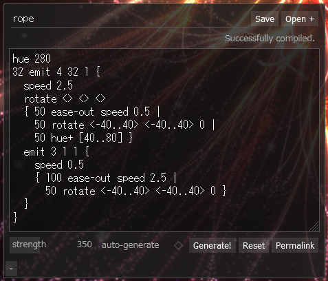
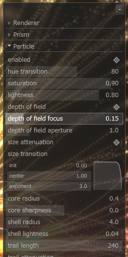

- [github.com/yubrot/emitter3d](https://github.com/yubrot/emitter3d)
- [Live demo](https://yubrot.github.io/emitter3d/)

TypeScript + three.js 製の、パーティクルの幾何的な動きをランダム生成して眺めるデモ。

<!--more-->

---


{{< largeimage src="3.jpg" title="Demo" link="https://yubrot.github.io/emitter3d/#eyJzdGVwc1BlclNlY29uZCI6MTIwLCJzdGVwc1BlclVwZGF0ZSI6MC44MDAwMDAwMDAwMDAwMDAyLCJlZGl0aW5nSXRlbSI6IkdlbmVyYXRpb24gMTMyIiwiZWRpdGluZ0NvZGUiOiJodWUgMTQwXG4yMDcgZW1pdCAxIDYwIDEge1xuICByb3RhdGUgMCBbMC4uMzYwXSAwXG4gIGh1ZSsgWzAuLjEyMF1cbiAge1xuICAgIHNwZWVkIDIuNzVcbiAgICAxMiBub3BcbiAgICBzcGVlZCAwXG4gIHxcbiAgICA1MyBlYXNlLW91dCByb3RhdGUgODYgMTAxIDBcbiAgfVxuICAwIGVtaXQgMiAxIDQge1xuICAgIHJvdGF0ZSAwIDAgW11cbiAgICByb3RhdGUgMTIwIDAgMFxuICAgIGh1ZSsgNjBcbiAgICBzcGVlZCAwLjgyXG4gICAgNzAgZWFzZS1pbiByb3RhdGUgMSAwIDEzXG4gICAgNTAgY2xvc2VcbiAgICAxMjAgbm9wXG4gICAgMzAgb3BhY2l0eSAwXG4gIH1cbn0iLCJnZW5lcmF0ZUF1dG9tYXRpY2FsbHkiOmZhbHNlLCJhbnRpYWxpYXMiOnRydWUsImJsb29tVGhyZXNob2xkIjowLjUsInByaXNtIjp0cnVlLCJwcmlzbVNhdHVyYXRpb24iOjAuNiwicHJpc21MaWdodG5lc3MiOjAuNCwicHJpc21TbmFwc2hvdE9mZnNldCI6MTYsInByaXNtVHJhaWxMZW5ndGgiOjI0LCJwcmlzbVRyYWlsU3RlcCI6MSwicHJpc21UcmFpbEF0dGVudWF0aW9uIjp7ImluaXQiOjAuMiwiY2VudGVyIjoxLCJleHBvbmVudCI6LTJ9LCJwYXJ0aWNsZUh1ZVRyYW5zaXRpb24iOi02MCwicGFydGljbGVTYXR1cmF0aW9uIjowLjgsInBhcnRpY2xlTGlnaHRuZXNzIjowLjYsInBhcnRpY2xlU2l6ZVRyYW5zaXRpb24iOnsiaW5pdCI6MCwiY2VudGVyIjoxLCJleHBvbmVudCI6LTF9LCJwYXJ0aWNsZUNvcmVSYWRpdXMiOjEuMiwicGFydGljbGVDb3JlU2hhcnBuZXNzIjozLCJwYXJ0aWNsZVNoZWxsUmFkaXVzIjoyMCwicGFydGljbGVTaGVsbExpZ2h0bmVzcyI6MC4wOCwicGFydGljbGVTbmFwc2hvdE9mZnNldCI6MjYsInBhcnRpY2xlVHJhaWxMZW5ndGgiOjU1LCJwYXJ0aWNsZVRyYWlsQXR0ZW51YXRpb24iOnsiaW5pdCI6MC4zLCJjZW50ZXIiOjEsImV4cG9uZW50IjowLjV9LCJwYXJ0aWNsZVRyYWlsRGlmZnVzaW9uU2NhbGUiOjMwLCJwYXJ0aWNsZVRyYWlsRGlmZnVzaW9uVHJhbnNpdGlvbiI6eyJpbml0IjowLCJjZW50ZXIiOjAsImV4cG9uZW50IjotMn0sInBhcnRpY2xlVHJhaWxEaWZmdXNpb25GaW5lbmVzcyI6My41LCJwYXJ0aWNsZVRyYWlsRGlmZnVzaW9uU2hha2luZXNzIjoyfQ%3D%3D" >}}



{{< largeimage src="1.jpg" title="Demo" link="https://yubrot.github.io/emitter3d/#eyJzdGVwc1BlclVwZGF0ZSI6MC40LCJlZGl0aW5nSXRlbSI6IkdlbmVyYXRpb24gMTgiLCJlZGl0aW5nQ29kZSI6Imh1ZSAyMDFcbmVtaXQgMSAxIDkge1xuICByb3RhdGUgMCBbXSAwXG4gIGh1ZSsgNjBcbiAgc3BlZWQgMS43XG4gIHtcbiAgICA4NSBlYXNlLW91dCBzcGVlZCAwLjJcbiAgfFxuICAgIDg1IGVhc2UtaW4gcm90YXRlIDY1IDAgMTI0XG4gIH1cbiAge1xuICAgIDY3IGVtaXQgMSAxMyAxIHtcbiAgICAgIGh1ZSsgNjBcbiAgICAgIHNwZWVkIDEuMDJcbiAgICAgIDM5IG5vcFxuICAgICAgMCBlbWl0IDIgMSAxIHtcbiAgICAgICAgcm90YXRlIDAgMCBbXVxuICAgICAgICByb3RhdGUgMTIwIDAgMFxuICAgICAgICBodWUrIDYwXG4gICAgICAgIHNwZWVkIDIuMTJcbiAgICAgICAge1xuICAgICAgICAgIDYxIGVhc2UtaW4gc3BlZWQqIDAuMjFcbiAgICAgICAgfFxuICAgICAgICAgIDYxIGVhc2UtaW4gcm90YXRlIDIwMiAwIC0xODBcbiAgICAgICAgfFxuICAgICAgICAgIDMwLjUgbm9wXG4gICAgICAgICAgMzAuNSBodWUrIC0xMjJcbiAgICAgICAgfVxuICAgICAgICAxODAgbm9wXG4gICAgICAgIDMwIG9wYWNpdHkgMFxuICAgICAgICBjbG9zZVxuICAgICAgfVxuICAgIH1cbiAgfFxuICAgIDY3IGVhc2UtaW4gcm90YXRlIDAgMTc3IDBcbiAgfVxufSIsImdlbmVyYXRlQXV0b21hdGljYWxseSI6ZmFsc2UsImJsb29tU3RyZW5ndGgiOjEsInBhcnRpY2xlRG9mIjp0cnVlLCJwYXJ0aWNsZUNvcmVSYWRpdXMiOjAuNiwicGFydGljbGVTaGVsbFJhZGl1cyI6OC4wMDAwMDAwMDAwMDAwMDUsInBhcnRpY2xlU2hlbGxMaWdodG5lc3MiOjAuMDMsInBhcnRpY2xlVHJhaWxEaWZmdXNpb25TY2FsZSI6MzAsInBhcnRpY2xlVHJhaWxEaWZmdXNpb25UcmFuc2l0aW9uIjp7ImluaXQiOjAsImNlbnRlciI6MCwiZXhwb25lbnQiOi0yfSwicGFydGljbGVUcmFpbERpZmZ1c2lvbkZpbmVuZXNzIjo1LCJwYXJ0aWNsZVRyYWlsRGlmZnVzaW9uU2hha2luZXNzIjozLjUwMDAwMDAwMDAwMDAwMDR9" >}}
{{< largeimage src="2.jpg" title="Demo" link="https://yubrot.github.io/emitter3d/#eyJzdGVwc1BlclNlY29uZCI6MTcwLCJlZGl0aW5nSXRlbSI6IkdlbmVyYXRpb24gODYiLCJlZGl0aW5nQ29kZSI6Imh1ZSAyODNcbjAgZW1pdCAxMSAxIDMge1xuICByb3RhdGUgMCBbXSAwXG4gIGh1ZSsgNjBcbiAgc3BlZWQgMi4wMlxuICA4MiBlYXNlLW91dCBzcGVlZCAwLjJcbiAge1xuICAgIDY3IGVtaXQgMSA3IDEge1xuICAgICAgaHVlKyA2MFxuICAgICAgc3BlZWQgMC4zXG4gICAgICAyOSBub3BcbiAgICAgIHtcbiAgICAgICAgNDggZWFzZS1pbiBzcGVlZCogNC4zMlxuICAgICAgfFxuICAgICAgICA0OCBlYXNlLWluIHJvdGF0ZSAyOSAxMjcgMVxuICAgICAgfFxuICAgICAgICA0OCBodWUrIDE0NFxuICAgICAgfVxuICAgICAgMTAzIGNsb3NlXG4gICAgICAxMjAgbm9wXG4gICAgICAzMCBvcGFjaXR5IDBcbiAgICB9XG4gIHxcbiAgICA2NyBlYXNlLWluIHJvdGF0ZSAxMzMgMTYzIDE1N1xuICB9XG59IiwiZ2VuZXJhdGVBdXRvbWF0aWNhbGx5IjpmYWxzZSwicHJpc21TYXR1cmF0aW9uIjowLjQsInByaXNtTGlnaHRuZXNzIjowLjQsInByaXNtVHJhaWxMZW5ndGgiOjI0LCJwcmlzbVRyYWlsU3RlcCI6MSwicHJpc21UcmFpbEF0dGVudWF0aW9uIjp7ImluaXQiOjAuMiwiY2VudGVyIjoxLCJleHBvbmVudCI6LTJ9LCJwYXJ0aWNsZVRyYWlsTGVuZ3RoIjoyNDAsInBhcnRpY2xlVHJhaWxEaWZmdXNpb25TY2FsZSI6MH0%3D" >}}
{{< largeimage src="4.jpg" title="Demo" link="https://yubrot.github.io/emitter3d/#eyJzdGVwc1BlclVwZGF0ZSI6MC41OTk5OTk5OTk5OTk5OTk4LCJlZGl0aW5nSXRlbSI6InJvcGUiLCJlZGl0aW5nQ29kZSI6Imh1ZSAyODBcbjMyIGVtaXQgNCAzMiAxIHtcbiAgc3BlZWQgMi41XG4gIHJvdGF0ZSA8PiA8PiA8PlxuICB7IDUwIGVhc2Utb3V0IHNwZWVkIDAuNSB8XG4gICAgNTAgcm90YXRlIDwtNDAuLjQwPiA8LTQwLi40MD4gMCB8XG4gICAgNTAgaHVlKyBbNDAuLjgwXSB9XG4gIGVtaXQgMyAxIDEge1xuICAgIHNwZWVkIDAuNVxuICAgIHsgMTAwIGVhc2Utb3V0IHNwZWVkIDIuNSB8XG4gICAgICA1MCByb3RhdGUgPC00MC4uNDA%2BIDwtNDAuLjQwPiAwIH1cbiAgfVxufSIsImdlbmVyYXRlQXV0b21hdGljYWxseSI6ZmFsc2UsImJsb29tU3RyZW5ndGgiOjAuMzk5OTk5OTk5OTk5OTk5ODYsInBhcnRpY2xlSHVlVHJhbnNpdGlvbiI6ODAsInBhcnRpY2xlU2F0dXJhdGlvbiI6MC45LCJwYXJ0aWNsZUxpZ2h0bmVzcyI6MC44LCJwYXJ0aWNsZURvZiI6dHJ1ZSwicGFydGljbGVEb2ZBcGVydHVyZSI6MC45OTk5OTk5OTk5OTk5OTk5LCJwYXJ0aWNsZVNpemVUcmFuc2l0aW9uIjp7ImluaXQiOjAsImNlbnRlciI6MSwiZXhwb25lbnQiOjN9LCJwYXJ0aWNsZUNvcmVSYWRpdXMiOjAuNCwicGFydGljbGVDb3JlU2hhcnBuZXNzIjowLCJwYXJ0aWNsZVNoZWxsUmFkaXVzIjo0LCJwYXJ0aWNsZVNoZWxsTGlnaHRuZXNzIjowLjA0LCJwYXJ0aWNsZVRyYWlsTGVuZ3RoIjoyNDAsInBhcnRpY2xlVHJhaWxBdHRlbnVhdGlvbiI6eyJpbml0IjowLjEsImNlbnRlciI6MSwiZXhwb25lbnQiOjF9LCJwYXJ0aWNsZVRyYWlsRGlmZnVzaW9uVHJhbnNpdGlvbiI6eyJpbml0IjowLjUsImNlbnRlciI6MSwiZXhwb25lbnQiOjEuNzAwMDAwMDAwMDAwMDAwMn0sInBhcnRpY2xlVHJhaWxEaWZmdXNpb25GaW5lbmVzcyI6NSwicGFydGljbGVUcmFpbERpZmZ1c2lvblNoYWtpbmVzcyI6NX0%3D" >}}


---

# Simulator

パーティクルがどの位置にあり、どのように動いているか等は全てシミュレータ上で計算される。ベクトルとクォータニオンの計算に[glMatrix](http://glmatrix.net/)を用いたが、それ以外は描画非依存の純粋な JS で記述されているため、emitter3d を載せてみたい環境があればシミュレータだけ移植して動かすことも考えられる。

## Behavior DSL



パーティクルの動作パターン(ビヘイビア)をランダム生成・記述するにあたって、[BulletML](http://www.asahi-net.or.jp/~cs8k-cyu/bulletml/)のような DSL を設けることにした。以下のような特徴を持つ:

- 内部的には S 式で、 [AST](https://github.com/yubrot/emitter3d/blob/master/src/simulator/dsl.ts)の構造は `Number`, `Symbol`, `List` だけ
- 3 つの括弧 `{}` `[]` `<>` による糖衣構文がある
- このうち `{}` で囲われた部分には特殊な構文が用いられ、特に改行が意味を持つ

まずは糖衣構文を含まない S 式でビヘイビアを書いてみる。
以下のコードは[Live Demo](https://yubrot.github.io/emitter3d/)の左下の `+` からコードエディタに貼り付けることで動作を確認できる。

```lisp
(block
  ((speed 1.5)
   (30 nop)
   (30 speed 0)
   (20 opacity 0)))
```

- `(speed 1.5)` で速度を設定している
  - 命令は `(op arg1 arg2 ...)` の形をとる
- `(30 nop)` `(30 speed 0)` のように数値を前置して、その命令に何ステップかけるかを設定している
- これらの命令列を `(block (...))` で直列に実行している

`block` は複数の命令列を引数に取ることができ、これらは並列に実行される。

```lisp
(block
  ((speed 2)
   // 速度の変化と回転を同時に行う
   (block
     ((30 speed 0) (30 speed 2))
     ((30 rotate 0 -90 0) (30 rotate 0 90 0)))))
```

子パーティクルの生成は `emit` 命令によって行う。 `emit` の 4 番目の引数に与えられた命令列が子の動作パターンになる。

```lisp
(block
  ((speed 1)
   (40 nop)
   (emit 8 1 1 (60 nop))))
```

`40 nop` のあと、 `emit` 命令によって子のパーティクルが 8 個生成され、それぞれが `60 nop` して消滅する。

しかしながらこれではパーティクルが重なって生成され、同じように動作するだけなので、「それぞれのパーティクルを放つ方向を変える」ということを表現したい。 `emit` 命令に「どのような方向に向けて」といった引数を加えることも可能なように思われるが、emitter3d では「生成後のパーティクルがそれぞれ別の方向を向く」という形で表現している。

```lisp
(block
  ((speed 1)
   (40 nop)
   (emit 8 1 1 (block
     ((rotate 0 ($each-range -45 45) 0)
      (60 nop))))))
```

それぞれのパーティクルは自身が `emit` 命令において何番目に生成されたかを知っており、その情報に基づいてパーティクルごとに異なるパラメータによる動作をさせることができる。 `($each-range -45 45)` は、 `emit` 命令において何番目に生成されたかに基づいて `-45` から `45` に均等に割り振られた値を採用する。これで弾幕シューティングにおける n-way 弾が実装できる。

同様の命令に `$each-choice` `$each-angle` がある。

```lisp
(emit 24 1 1 (block
  ((speed 1)
   (rotate 0 $each-angle 0)
   (30 nop)
   (30 rotate 0 ($each-choice -40 40) 0)
   (60 nop))))
```

`($each-choice -40 40)` は 0 番目のパーティクルは `-40`, 1 番目のパーティクルは `40`, 2 番目のパーティクルは `-40`, ...のように順番に値を採用する。 `$each-angle` は `($each-range 0 360)` に似ているが、終端を含まないように数値が割り振られるので、これによって全方位向きのパーティクルが重なって生成されないようにするなどができる。

パーティクルごとにランダムな値を採用する `$random-range` `$random-choice` `$random-angle` もあるが、見栄えの良さには幾何的な動作が強く影響するのであまり利用頻度は多くなかった。

```lisp
(100 emit 1 100 1 (block
  ((speed ($random-range 3 4))
   (hue ($random-choice 200 240 270))
   (rotate $random-angle $random-angle $random-angle)
   (60 ease-out speed 0)
   (30 opacity 0))))
```

## DSL の糖衣構文

前述のとおり `{}` `[]` `<>` には糖衣構文が割り当てられている。DSL かつベースが S 式ということで、頻出のパターンにこのような字句要素を惜しみなく与えることができる。

`[]` `<>` は簡単で、それぞれ `$each-xxx` `$random-xxx` への糖衣構文となる。

```lisp
[-45 .. 45]  // ($each-range -45 45)
[30 -30]     // ($each-choice 30 -30)
[]           // $each-angle
<-45 .. 45>  // ($random-range -45 45)
<30 -30>     // ($random-choice 30 -30)
<>           // $random-angle
```

`{}` は `block` だ。 `;` と `|` で区切って直列、並列な動作を記述する。

```lisp
{
  (speed 2);
  {
    (30 speed 0);
    (30 speed 2)
  |
    (30 rotate 0 -90 0);
    (30 rotate 0 90 0)
  }
}
```

このセミコロンの存在は不思議に思われるかもしれない。それぞれの S 式の終端は明白なので不必要な区切りのはずだ。
実際には、 `{}` 内の命令列は従来の S 式の列とは構文解釈が異なる。具体的には `{}` 内では、

1. セミコロンは「文」の区切りとして解釈される。
2. それぞれの文について、S 式が 2 つ以上含まれる文なら、両端に括弧を補って一つの式として解釈される。

したがって上の定義は以下のように括弧を省略して記述できる。セミコロンが意味のある区切りとなった。

```lisp
{
  speed 2;
  {
    30 speed 0;
    30 speed 2
  |
    30 rotate 0 -90 0;
    30 rotate 0 90 0
  }
}
```

さらに `{}` の中では改行も単なるスペースではなく、セミコロンと同様に文の区切りとして扱われるため、今回の例はそのままセミコロンを省略できる。

```lisp
{
  speed 2
  {
    30 speed 0
    30 speed 2
  |
    30 rotate 0 -90 0
    30 rotate 0 90 0
  }
}
```

最後に、トップレベルも `{}` 中と同様のパースが行われるため、トップレベルの `{}` を取り除くことができる。

```lisp
speed 2
{
  30 speed 0
  30 speed 2
|
  30 rotate 0 -90 0
  30 rotate 0 90 0
}
```

emit の例も。全体として表面上は S 式っぽさがない記述になる。

```lisp
emit 24 1 1 {
  speed 1
  rotate 0 [] 0
  30 nop
  30 rotate 0 [-40 40] 0
  60 nop
}
```

Behavior DSL は基本的にはこれだけである。その他、左下コードエディタの `Open +` からサンプルコードや命令セットの一覧が確認できるほか、ランダムなパターン生成 (`auto-generate` にチェックを入れることで行われる) のたびコードエディタのコードが目まぐるしく変わっていくのでその辺を合わせて眺めてもらいたい。

---

# Viewer

シミュレータは各パーティクルがどの位置にどの姿勢であるかを計算するが、ビューアはこれを WebGL でスクリーン上に描画する役割を担う。ビューアの実装では WebGL のライブラリとして最もポピュラーであろう[three.js](https://threejs.org/)を用いている。

ビューアの実装は基本的には three.js の `Points` と `Mesh` (パフォーマンスのため Geometry instancing を行っている) を用いた単純なものだが、パーティクルの軌跡の描画が特徴的だろう。
ビューア側で表示されるオブジェクトの状態は、一定時間ごとに (デフォルトでは毎秒 60 回程度) [シミュレータ側の座標や向きなどの状態をビューア側のバッファにコピーする](https://github.com/yubrot/emitter3d/blob/master/src/bridge.ts)形で更新している。ここでビューアは最新の状態だけをバッファに持つのではなく、過去数十ステップの状態を保持するようにしている。この状態を元に、それぞれどれぐらい過去の状態かに基づいて不透明度を下げたり、座標を Simplex noise によって拡散させて重ねて表示することで、彗星のように尾を引いた、軌跡を加味した描画が可能になる。

JavaScript でこういうものを実装する上では、もちろん不必要な計算を削減して高速化するのも重要だが、アロケーションの頻度を減らすのが重要になる。three.js も実装を覗いてみると徹底して新しいアロケーションが発生しないように気を遣った実装になっていることがわかる。WebAssembly に移植して自分で管理するとかやってみてもいいかもしれない。



シミュレータ側はひたすら小さな命令を沢山組み合わせられるようにしていたが、ビューア側は単に大量のパラメータをいじって描画を細かく調整できるようにしている。パラメータ群は画面右上の `+` から編集できる。

ビューアには重要な課題が一つある。現在のビューアはひたすら加算合成しているので、一定以上のボリュームがあるとあっさりと画面が潰れてしまう。three.js 上でこのあたりの表現を突き詰めていくのは少々しんどいので気が向いたら Unity 上での実装を試みたい。ボリュームのあるパーティクルがいい感じに映るビューアではパターン生成で適切な量・密度も変わってくるのでほとんど全て再調整することになるだろう。

---

# Application

コードエディタや、ビューアのパラメータ群を含む DOM を組み上げてアプリケーションを構成する部分は[Preact](https://preactjs.com/)を採用した。Preact は React のサブセットで、3kB という軽量さでありつつ、Hooks や Context を含む React の多くの機能を React と同じように使うことができる。

TypeScript の型定義も勿論用意されている。ただ CSS-in-JS の選択肢はちょっと限られていて、DOM レンダリングエンジンに非依存な[Aphrodite](https://github.com/Khan/aphrodite)を用いた。

シミュレータの動作や three.js の描画など、コンポーネント視点で純粋でない部分をどう扱うか迷ったが、Hooks API による **エフェクト** として表現することにした。特に three.js の描画は特定の canvas 要素上で行われるが、これを **canvas 要素を appendChild するコンポーネント自身がビューアのコンテキストの全てを所有している** と考えるのではなく、 **ビューアはエフェクトの外側に独立して存在していて、描画結果を表示したいコンポーネントがビューアから canvas 要素を借用して appendChild する** と考えるようにした。例えば、[Screen.tsx](https://github.com/yubrot/emitter3d/blob/master/src/application/screen.tsx)は `useViewer()` でビューアのエフェクトを伴い、 `viewer.renderer.domElement` を借用して自身の `render` 結果上にマウントしている。

ビューアの為のパラメータ群も Hooks を介したストアに保持する。シミュレータも Hooks を介して扱う。このようにすると、アプリケーション内の相互作用をコンポーネント非依存の **エフェクトを伴う関数** に集中して実装できる。 [system.ts](https://github.com/yubrot/emitter3d/blob/master/src/application/system.ts) を参照。
