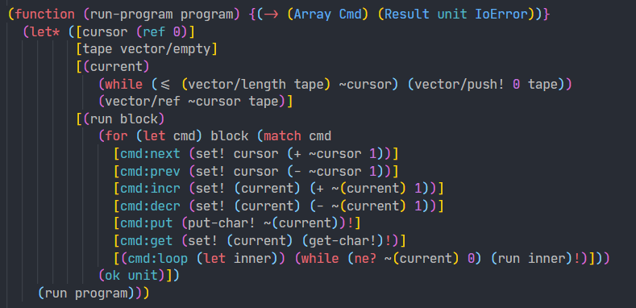
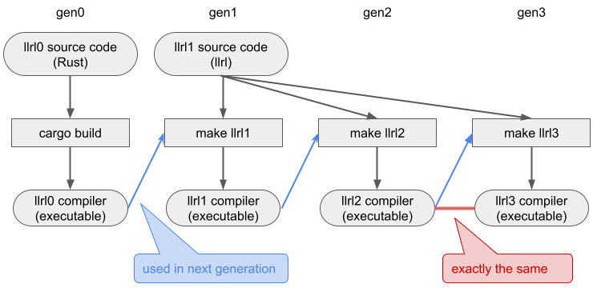

- [github.com/yubrot/llrl](https://github.com/yubrot/llrl)

Rust + LLVM による自作プログラミング言語処理系。大きな特徴は以下の 3 つ。

- Hindley-Milner ベースの型推論による静的型付け (+型クラス)
- Lisp-like な S 式によるシンタックスと LLVM JIT によるマクロ
- **完全なセルフホスティングコンパイラ実装**

<!--more-->



---

# 目標: セルフホスティング

llrl は複合的な理由で作り始めたが、とにかく一度完全にセルフホストされた言語処理系を実装したいという気持ちからセルフホスティングを最優先の目標とした。

プログラミング言語のセルフホスティングは、以下のような明確なゴールを設定できる。

- 何らかの既存のプログラミング言語によって自作言語コンパイラを実装する → 世代 0
- 自作言語、およびその標準ライブラリをコンパイラを実装できるまで充実させる
- 自作言語のコンパイラ実装を自作言語自身で改めて記述(移植)する → 世代 1
- 世代 1 によるコンパイラで、自作言語によるコンパイラ実装自身をコンパイルする → 世代 2..
- → **ある世代のコンパイラの実行バイナリが、その前の世代のコンパイラの実行バイナリと完全に一致する**

llrl においては、世代 2 以降のコンパイラの実行バイナリが完全一致する。世代 2 以降のコンパイラは llrl によって記述されたコンパイラ実装(llrl1 source code)をコンパイルでき、その結果の実行バイナリはコンパイラ自身と完全に一致する。




llrl1 compiler と llrl2 compiler は一致しても良さそうに見えるが、Rust による llrl コンパイラ(llrl0 compiler)は意味解析が並列化されていたりハッシュテーブルのシード値がランダムであったりを原因としてコンパイラは常に同じ結果を出力するように作られていない他、細かな違いがあり、それによってコンパイルされた llrl1 compiler は llrl2 compiler と一致しない。llrl による llrl コンパイラは完全に一致するように意図して作られている。


---

# 言語デザイン

プログラミング言語の言語デザインと実装にあたって、本気で現代的なプログラミング環境に欲しいものを挙げていくとキリがない。理想的なプログラミング言語というものは存在しないか、ユースケースの数だけ存在してしまい、また到底個人の手に負えるものでもない。この点において、セルフホスティングは「言語自身が表現できなければならないこと」が明確なのでいいゴールになる。

ゴールが何であれ、言語デザインを簡単・単純にすればそれだけ実装量は少なくなる。特に既存の言語...C 言語のサブセットなどにすれば、その言語の標準ライブラリ実装や、その言語で実装された十分に枯れたコードをそのまま組み込むことができたり、またそのコードをコンパイラ自身がうまく動作しているかの検証にも使える。

しかし今回は新たな言語をデザインすることにした。理由にはいくつかある。

- C 言語を書きたくなかった
- ふと「個別に満足いくまで言語仕様を充実させなくとも、Lisp のマクロが静的型付け言語上で動いたら妥協できるのでは」と思いついた
- **標準ライブラリの実装にも目を向けたかった**

最後に挙げた理由が特に大きい。
実際[標準ライブラリ](https://github.com/yubrot/llrl/tree/main/std)を充実させていく過程で、既存のプログラミング言語の標準ライブラリ(Rust, OCaml, Haskell, Scheme あたりを特に参考にした)もそれぞれ言語に合わせた設計思想の違いがあるなあといったことを実感したり、[HashMap(Robin Hood Hashing)の実装](https://github.com/yubrot/llrl/blob/main/std/hash-map.llrl)からハッシュテーブルの具体的なメモリの占有率に対する肌感を得たりといった効果があった。

具体的な言語仕様は、

- [リポジトリの README](https://github.com/yubrot/llrl#readme)および Scrapbox の[概要](https://scrapbox.io/yubrot/llrl%E3%81%AE%E8%A8%80%E8%AA%9E%E3%81%AE%E6%A6%82%E8%A6%81)を参照。
- 言語デザイン上の細かい選択のメモは Scrapbox の[言語デザイン上の選択](https://scrapbox.io/yubrot/llrl%E3%81%AE%E8%A8%80%E8%AA%9E%E3%83%87%E3%82%B6%E3%82%A4%E3%83%B3%E4%B8%8A%E3%81%AE%E9%81%B8%E6%8A%9E)に。

言語の特徴に挙げた型システムとマクロについては後ほどもう少し掘り下げる。

# Rust による実装

llrl の最初のコンパイラの実装には Rust を採用した。

Rust は以前から書いてみたかった言語で、この課題は Rust を試すのにも丁度よかった。言語実装はデータ構造を結構こねくり回すことになるので、Rust の所有権システムの実際の書き心地が感じられそうだなと。

> 本気で現代的なプログラミング環境に欲しいものを挙げていくとキリがない。理想的なプログラミング言語というものは存在しないか、ユースケースの数だけ存在してしまう。また到底個人の手に負えるものでもない。

先ほどこのように書いたが、Rust はまさにというか、システムプログラミング、安全性、パフォーマンスあたりへの強いフォーカスが感じられる。非常に書き心地は良いが、GC のある抽象度をより重視した言語と比べれば記述量も多い。また個人では成し得ない沢山の人の尽力が感じられる言語でもある。言語仕様はもそうだが、エコシステム全体が何というか行き届いている。コンパイラを実装していて、また標準ライブラリの実装にあたって Rust の std を参考にしていて、感心するばかりだった。

# LLVM の使用

llrl は LLVM の[Kaleidoscope Tutorial](https://llvm.org/docs/tutorial/index.html)に起源がある。このチュートリアルは LLVM を用いて Kaleidoscope という簡単な言語を実装するというものだ。Kaleidoscope は非常に小さく、チュートリアルを終えた時点では汎用プログラミング言語とは言えないが、浮動小数点数の基本的な演算をサポートし、関数定義を行うことができ、外部定義の `extern putchard(char)` を用いて簡単なマンデルブロ集合の描画まで実現している。

```kaleidoscope
def mandelhelp(xmin, xmax, xstep, ymin, ymax, ystep)
  for y = ymin, y < ymax, ystep in
    (for x = xmin, x < xmax, xstep in
      printdensity(mandelconverge(x,y)))
    : putchard(10)
```

このチュートリアルを終え、[LLVM-C API](https://llvm.org/doxygen/group__LLVMC.html)を眺めていて、チュートリアルを延長して C API を呼び出すための基本的な言語機能 (関数呼び出し、静的型、ポインタ等) を備えていけばセルフホスティングが十分視野に入ると思ったのもこのプロジェクトの最初のモチベーションとなっている。C API を呼べるというのはそこそこの言語仕様が必要となる一方、実装する言語にリッチなランタイムシステムも必要とされない。

# Hindley-Milner 型システム + 型クラス

型システムは Hindley-Milner 型システムをベースに、型クラスを加えたものとした。
型クラスを含めて型システムは[Typing Haskell in Haskell](https://web.cecs.pdx.edu/~mpj/thih/)をおおよそ踏襲した形とも言える。

型システムも拘り始めると無限に時間が溶けていくことが容易に想像できる。セルフホスティングを目標とすると手頃な型システムを採用するのが無難だ。Hindley-Milner 型システムはよく枯れた手頃な型システムであり、自分自身[Titan Type Checker](/2021/07/titan-type-checker/)で実装したことがあったので丁度良かった。とはいえ llrl ではモジュール内の定義の相互参照をサポートするとしたので、依存性解析を行って順に型変数を振って多相化して、みたいな手間はかかった。
HM 型システムの都合の良いところは他にも挙げられる。llrl では Lisp っぽい構文とマクロをサポートしたいと考えていたが、HM 型システムはほとんど型注釈を必要とせずに型付けできるので、古典的な「Lisp っぽさ」が維持された(※型注釈は Lisp コードっぽくない)コードをそのまま動作させられる。もちろん、 `(list 123 "456")` のようなコードは型チェックを通らないし、型チェックが通れば動かせるというだけで実際のほとんどの llrl によるコードは型を明示しているが...

型クラスはセルフホスティングを目標にする上ではまったく必要ないが、最初のコンパイラは Rust で実装するので **セルフホスティングコンパイラの実装時には Rust の実装をできるだけ直接移植できるのが望ましい**。 Rust においてトレイト(型クラス相当)は多用されるので、型クラスが無いとセルフホスティング実装と Rust 実装のギャップが大きくなりがちとなる。
実際のところ、型クラスの実装はそこそこ意味解析やコード生成前の展開の手間が増えて大変だった。しかし型クラス無しでは相当しんどいかアドホックになるプログラム (再帰的な `DebugDisplay` の実装とか) がきれいに解決するので導入して良かったかと思う。ゼロコストで[Expression problem](https://ja.wikipedia.org/wiki/Expression_problem)を解決できる機能が一つは欲しかったというのもある。

## Lisp-like なマクロ

現代のプログラミング言語には使い心地を改善する細かい言語機能が多々あるが、自作言語でこのような対応を逐一行っていくのは非常に大変だ。

> ふと「個別に満足いくまで言語仕様を充実させなくとも、Lisp のマクロが静的型付け言語上で動いたら妥協できるのでは」と思いついた

と言語デザインで書いたように、llrl では言語機能を絞る代わりに Lisp っぽいマクロをサポートした。「Lisp っぽいマクロ」にも色々あるが、llrl ではいわゆる伝統的な S 式を入力にとって S 式を返すマクロ関数の定義をサポートしている。
ただし llrl は静的型付けなので、マクロ関数も一般的な関数と同様に静的に型付けされ、型は `(-> (Syntax Sexp) (Result (Syntax Sexp) String))` 固定となる。

マクロは llrl 上で自己拡張的にエコシステムが構築されているので面白いかと思う。

1. コンパイラは、コンパイラの認識する[S 式のデータ構造の定義](https://github.com/yubrot/llrl/blob/main/llrl0/src/ast/builtin.llrl#L114-L128)だけを提供する。 `(Syntax A)` はコンテキスト情報を隠蔽したオブジェクトで、S 式の構造は他のデータ構造の定義と同じく `(value-data Sexp ...)` として定義される。
2. まず [`(Syntax A)` の着脱を省略する `s:_` マクロを定義する](https://github.com/yubrot/llrl/blob/main/std/boot/0-s.llrl)。
3. (2) を用いて[`quasiquote` マクロを定義する](https://github.com/yubrot/llrl/blob/main/std/boot/3-quasiquote.llrl)。 `quasiquote` は `(s:symbol "unquote")` や `(s:symbol "unquote-splicing")` を処理しつつ `s:_` による S 式の構築に変換する。
4. (2) を用いて [`s/match` マクロを定義する](https://github.com/yubrot/llrl/blob/main/std/boot/2-s-match.llrl)。 `s/match` はパターン部分の S 式を `s:_` によるパターンに変換する。
5. (3, 4) を合わせると、 `(value-data Sexp ...)` の具体的な内部構造を意識せずに S 式を分解・構築できる。例えば `lambda` は以下のようなマクロとして定義されている:
   ```lisp
   (macro (lambda s)
     (s/match s
       [(_ ,args ,@body)
         (ok
           (let ([tmp-f (gensym)])
             `(let ([(,tmp-f ,@args) ,@body])
               ,tmp-f)))]
       [_
         (err "Expected (lambda (arg ...) body ...)")]))
   ```

llrl では LLVM を採用したので、マクロの実行も LLVM の JIT 機能を用いている。Rust 実装では[Rust のデータ構造と llrl の ABI 互換なデータ構造との相互変換が挟まる](https://github.com/yubrot/llrl/blob/main/llrl0/src/backend/llvm/runtime.rs#L7-L16)が、llrl ではホスト自身が llrl なのでそのような変換が挟まらないのが少し面白い。

---

# 展望とか今後の課題とか

言語の実装は全体として楽しかったが、とにかくキリがない。まずセルフホスティングの達成まで半年かかった。ここまでかけるつもりは全くなかった。実用的なプログラミング言語は素晴らしい。デイリーワークの中で発生するプログラミング環境への様々な不満を処理系の気持ちになって難しい課題ですねと流す余裕ができるかもしれない。

llrl は全体としてセルフホスティングにフォーカスしたことである程度の規模ながら完成に至った一方、明確な課題がいくつか残っている。またセルフホスティング以外にも試みたいことは非常に沢山ある。

- 言語機能の拡張。これ一つとっても挙げるとキリがないが...型クラスにはやはり fundeps か関連型が欲しいとか、型シノニムが無いのが厳しいとか、パターンをユーザ定義したいとか、衛生的なマクロとか。
- デバッグ。スタックトレースが無いのが致命的すぎる。シンボルテーブルに元の関数名らしき文字列すら残っていない。意味解析中のエラー出力もマクロの関係でエラーの発生位置情報がまるで役に立たないこともしばしばある。
- バックエンド側への理解を深める。現在の実装は Linux x64 と LLVM に強く依存していて、コンパイラのバックエンド側(特に最適化)はほとんどノータッチと言える。 `c-function` で C API を呼び出せる機能はあるが、ABI 対応は[かなり適当である](https://github.com/yubrot/llrl/blob/main/llrl0/src/backend/llvm/artifact.rs#L450-L461)。最近だと WebAssembly に興味がありつつまだ触れていないので、セルフホスティング + ブラウザで動作といったことも試みたくある。巷には[AssemblyScript](https://www.assemblyscript.org/)とか[Grain](https://github.com/grain-lang/grain)とか WebAssembly を主要なターゲットとするプログラミング言語も存在する。
- ランタイムの改善。まずマルチスレッドプログラミングのことを何も考えていない。GC も、Boehm GC を使っているのに、標準ライブラリの `HashMap` の実装は削除された要素のメモリ領域をゼロ埋めしてなかったりとか保守的な GC に優しくもない。正確な GC が欲しい。他、「libc がやってくれていること」の解像度が非常に低く、ブラックボックス感があるので理解度を上げたい。[ゼロからの OS 自作入門](https://www.amazon.co.jp/dp/B08Z3MNR9J/)を積んでるのでまず読もう。
- 開発環境の改善。llrl 自身でプログラムを書いていて、エディタのサポートが無い大変さを痛感した。[Language Server Protocol](https://microsoft.github.io/language-server-protocol/)をサポートしたい。正直実装の検討もついていなくて、というのも llrl の現在の実装はインクリメンタルな意味解析どころか分割コンパイルすら全く考慮しておらず、またマルチスレッドプログラミングも一切考慮していないので、LSP では高速にインクリメンタルに意味解析をしつつクライアントと通信する必要があるということでかなり色々と考える必要がありそう。

---

# おまけ: パフォーマンス

パフォーマンスはあまり意識していないが、コンパイラ自身(標準ライブラリとあわせて 20k LOC 程度)を 25s ほどでコンパイルできたり、HashMap/OrdMap のベンチマークがある程度の時間で終わるなど、最低限の速度では動作する。

```rust
use std::collections::HashMap;
use std::collections::BTreeMap;
fn main() {
    let size = 10000000;

    let mut map = HashMap::new();
    for i in 0..size { map.insert(i, i * 2); }
    for i in 0..size { map.remove(&i); }

    let mut map = BTreeMap::new();
    for i in 0..size { map.insert(i, i * 2); }
    for i in 0..size { map.remove(&i); }
}
```

```lisp
(import "std/hash-map" _)
(import "std/ord-map" _)
(function size 10000000)

(let1 map hash-map/empty
  (for (let i) (iterator/range 0 size 1) (hash-map/insert! i (* i 2) map))
  (for (let i) (iterator/range 0 size 1) (hash-map/remove! i map)))

(let1 map ord-map/empty
  (for (let i) (iterator/range 0 size 1) (ord-map/insert! i (* i 2) map))
  (for (let i) (iterator/range 0 size 1) (ord-map/remove! i map)))
```

| 言語 | データ構造                            | 時間     |
| ---- | ------------------------------------- | -------- |
| Rust | ハッシュテーブル (SwissTable)         | 2.971sec |
| Rust | B 木                                  | 1.166sec |
| llrl | ハッシュテーブル (Robin Hood Hashing) | 5.880sec |
| llrl | B 木                                  | 4.595sec |

ところで、llrl と関係ないが、このように単純なキーだと (おそらくハッシュ関数のオーバーヘッドのため?) OrdMap (B 木)の方が高速に動作しているというのも注目したい。
